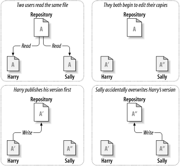
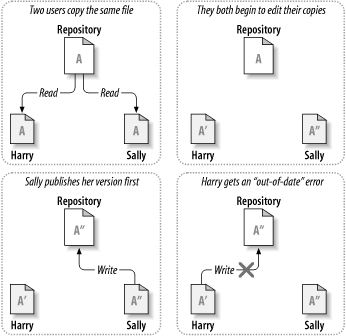

## 问题情景

如下图所示。假设现在有两个同事：Harry 和 Sally，他们在同一时间修改了仓库中的同一文件。如果 Harry 先把修改保存到仓库中，后面 Sally 就有可能用他的新版本文件覆盖掉 Harry 的版本。虽然 Harry 的修改不会就此丢失 (因为版本控制系统会记住每一次修改)，但是 Harry 的修改不会出现在 Sally 的新版本文件中，因为他从未看到过 Harry 的修改。从效果上来看，Harry 的修改丢失了—至少是对文件的最新版本来说 —而且很有可能是无意间导致的，那么如何避免这种情况的发生。

## 解决方案——加锁-修改-解锁模型

> 在加锁-修改-解锁（lock-modify-unlock）模型中，仓库一次只允许一个用户修改同一个文件，这种独占策略通过锁进行管理。

在上述的问题情景中，Harry 在修改之前要先对文件进行 “加锁” (lock)，如果 Harry 已经锁住了文件，Sally 就不能再对同一文件进行加锁，也就不能修改文件。Sally 所能做的就是等待 Harry 完成修改，保存文件，然后释放锁。Harry 解锁后才能轮到 Sally 加锁，然后他可能会得到一个新版本的文件并开始编辑。

加锁-修改-解锁（lock-modify-unlock）模型的缺点：

+ 加锁可能会导致管理上的问题：如果 Harry 在锁住一个文件后忘了给它解锁，Sally 就只能等着。
+ 加锁可能会导致不必要的串行化：如果 Harry 想要修改文件的开头部分, 而 Sally 只想修改同一文件的结尾部分，此时他们的修改就不会重叠。如果他们的修改可以恰当地合并在一起，那他们就可以同时编辑文件，完全不会产生任何问题。此时对文件进行加锁就完全没有必要。
+ 加锁可能会造成安全上的错觉：假设 Harry 加锁并修改了文件 A，同时 Sally 加锁并修改了文件 B，但文件 A 和文件 B 是互相依赖的。如果 Harry 和 Sally 的修改在语义上是不兼容的，文件 A 和文件 B 可能无法再正常工作。加锁-修改-解锁模型对这种情况无能为力——但是用户会错误地认为只要在加锁后修改就是安全的。通过加锁，Harry 和 Sally 都错误地认为自己的修改是安全的，也就不会事先和对方沟通。

## 解决方案——复制-修改-合并模型

> 在复制-修改-合并（copy-modify-merge）模型中，每一个用户的客户端都与仓库通信，用户在本地创建一份私有的工作副本后，不同的用户可以同时地、互不干扰地修改自己的私有副本，最后，私有副本被合并到一个新的最终版本。为了支持复制-修改-合并 模型，版本控制系统通常会提供合并操作，但是必须由用户自己来确保合并的结果是正确的。

在上述的问题情景中，假设 Harry 和 Sally 各自创建了同一项目的工作副本，并在各自的工作副本中修改了同一文件 A。Sally 先把修改保存到仓库中，后面 Harry 试图保存自己的修改时，仓库告诉他文件 A 已经 过时 (out of date ) 了，换句话说, 自从他上一次复制了文件 A 之后，仓库中的文件 A 被更新了。

于是，Harry 告诉客户端把仓库中文件 A 的更新合并到他的工作副本中 (这里不妨假设 Sally 的修改没有和他的修改重叠)，修改合并后，Harry 再一次向仓库保存了他自己的修改。

补充：如果 Sally 的修改和 Harry 重叠了，这种情况称为冲突 (conflict)，通常不是什么大问题。当 Harry 告诉客户端把仓库的最新修改合并到他的工作副本时，副本中的文件 A 被标记为冲突状态，Harry 可以同时看到互相冲突的两套修改，并对它们进行手工选择。软件不会自动地解决冲突，只有人类才能理解冲突并做出正确地选择。Harry 把重叠的修改解决后（可能是在和 Sally 沟通之后）就可以把合并后的文件安全地保存到仓库中。

复制-修改-合并（copy-modify-merge）模型的优点：
+ 用户可以并发地工作，不用等待其他人
+ 当用户操作同一文件时，经验表明他们的大多数修改不会重叠，冲突情况其实很少发生，而且解决冲突花费的时间通常要比使用锁机制浪费的时间要少得多。

复制-修改-合并（copy-modify-merge）模型的缺点：

+ 复制-修改-合并模型要求文件是支持合并的——也就是说文件是基于行的文本文件 (例如程序源代码文件)。对二进制文件 (例如图片和音频文件) 来说，合并有冲突的修改几乎是不可能完成的。在这种情况下，串行地修改文件就显得非常有必要。如果没有串行访问，用户花费大量时间作出的修改很可能会被丢弃。